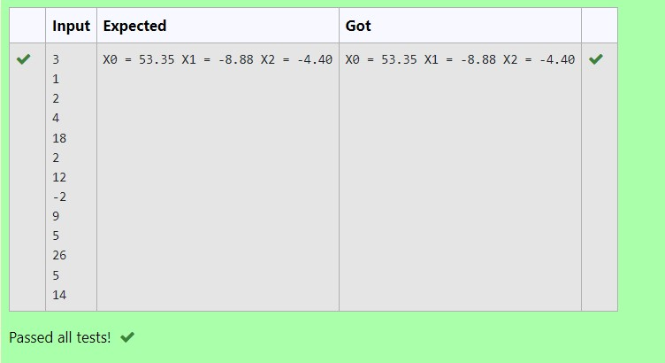

# Gaussian Elimination

## AIM:
To write a program to find the solution of a matrix using Gaussian Elimination.

## Equipments Required:
1. Hardware – PCs
2. Anaconda – Python 3.7 Installation / Moodle-Code Runner

## Algorithm
1. Declare the variables and read the order of the matrix n.
2. Take the coefficients of the linear equations as: Do for k=1 to n. ...
3. Do for k=1 to n-1. Do for i=k+1 to nDo for j=k+1 to n+1. ...
4. Compute x[n]=a[n][n+1]/a[n][n]
5. Do for k=n-1 to 1. sum=0. ...
6. Display the result x[k]


## Program:
```

Program to find the solution of a matrix using Gaussian Elimination.
Developed by: yoheshkumar R.M
RegisterNumber: 22008459

```
```python
import numpy as np
import sys
n=int(input())
a=np.zeros((n,n+1))
x=np.zeros(n)
for i in range(n):
    for j in range(n+1):
        a[i][j]=float(input())
for i in range(n):
    for j in range(i+1,n):
        ratio=a[j][i]/a[i][i]
        for k in range(n+1):
            a[j][k]=a[j][k]-ratio*a[i][k]
x[n-1]=a[n-1][n]/a[n-1][n-1]
for i in range(n-2,-1,-1):
    x[i]=a[i][n]
    for j in range(i+1,n):
        x[i]=x[i]-a[i][j]*x[j]
    x[i]=x[i]/a[i][i]
for i in range(n):
    print('X%d = %0.2f' %(i,x[i]),end=" ")
```

## Output:



## Result:
Thus the program to find the solution of a matrix using Gaussian Elimination is written and verified using python programming.

